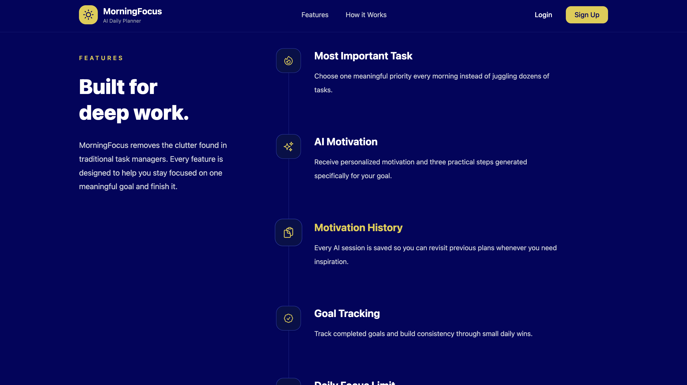
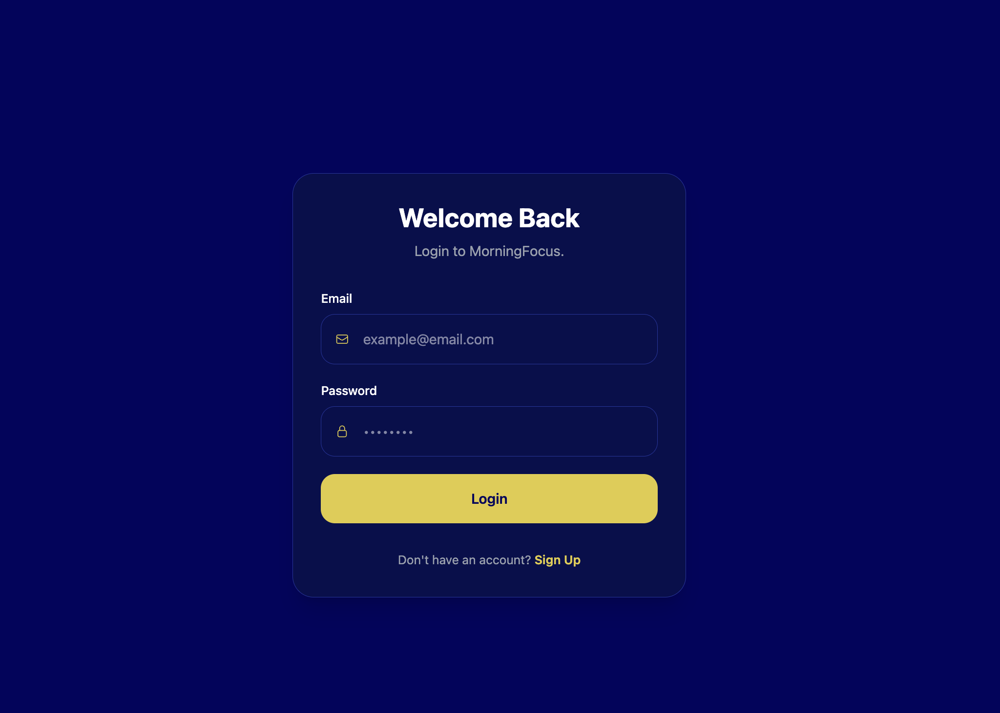
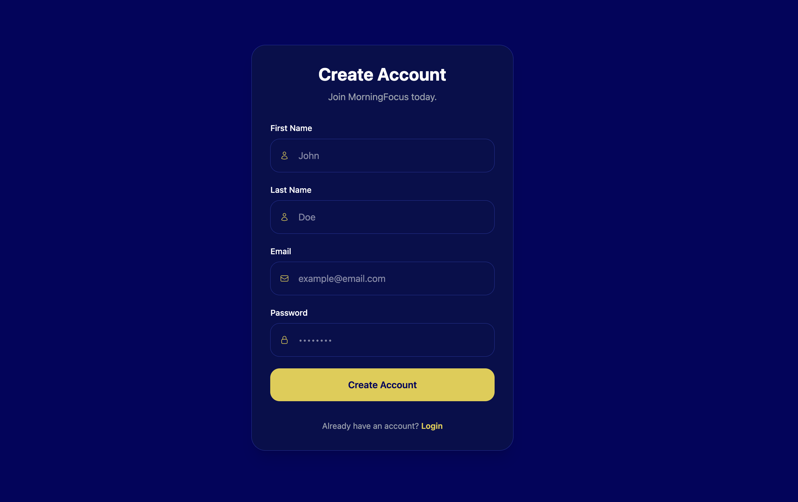
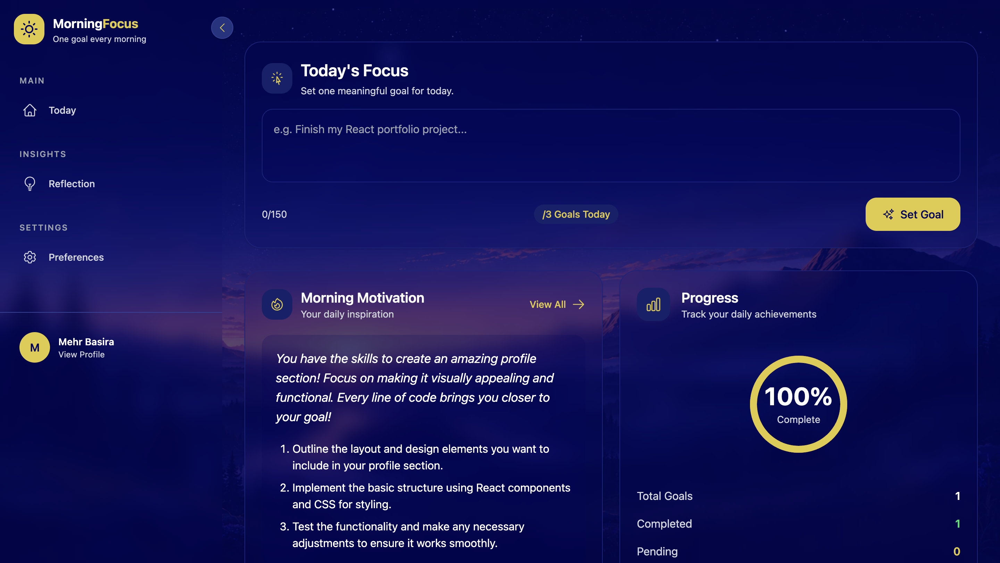
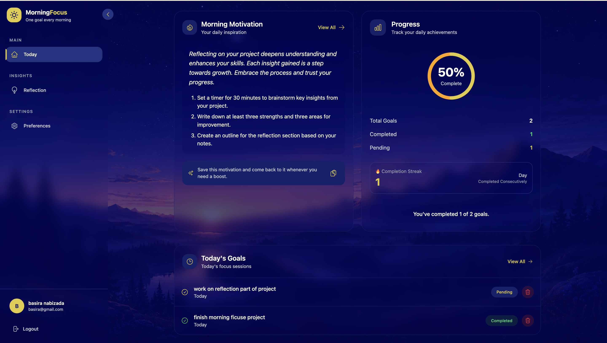
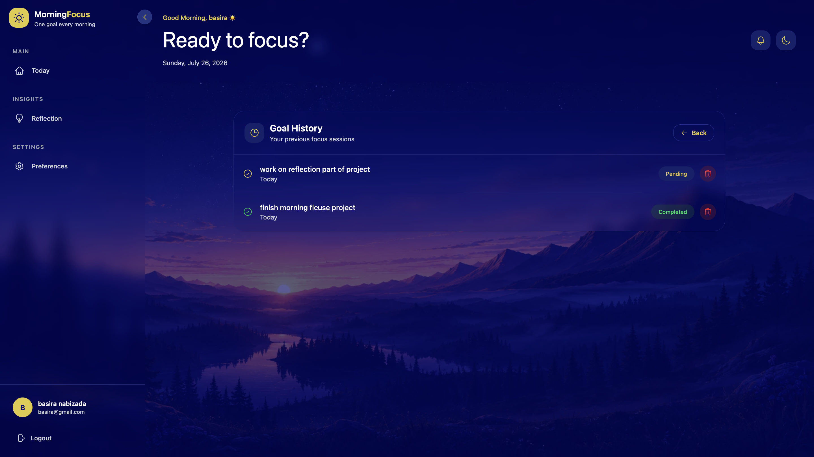
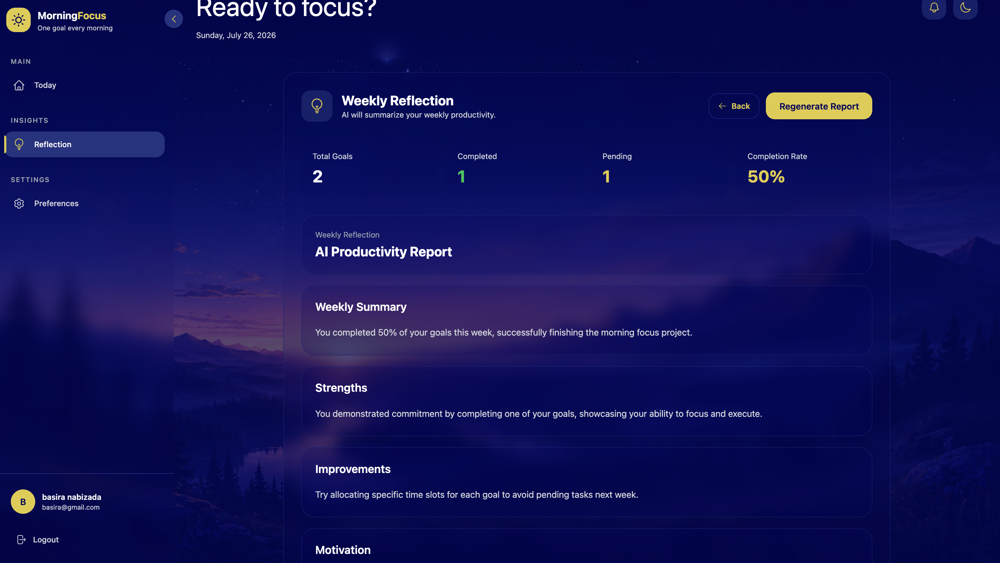
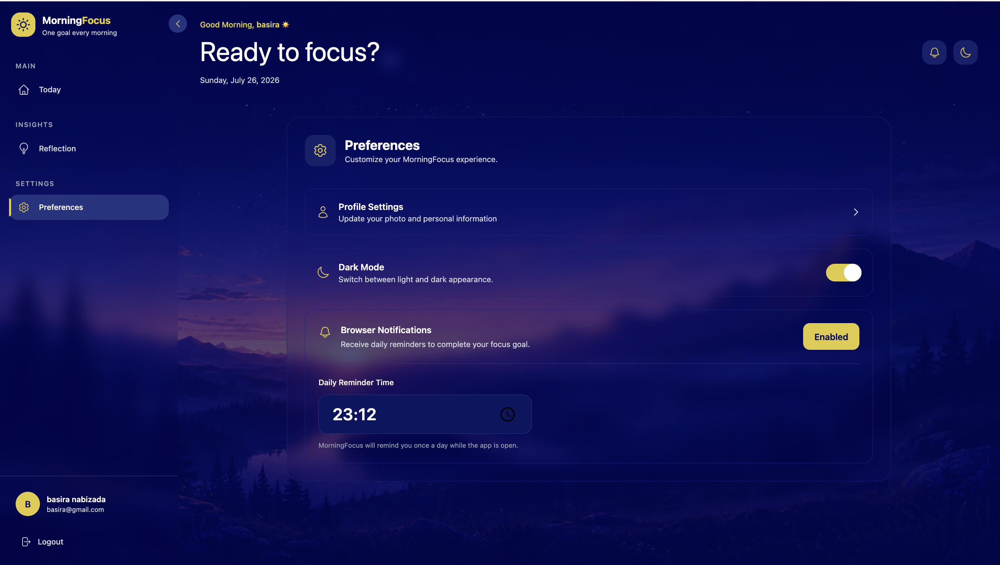

# MorningFocus – AI Daily Planner

MorningFocus is an AI-powered productivity application designed to help users focus on one meaningful goal each day. Instead of managing overwhelming task lists, users choose up to three daily priorities, receive AI-generated motivation and actionable steps, track their progress, and review weekly reflections to build long-term consistency.

---

# Live Demo

**Live Application**

## https://morningfocus.netlify.app/

# Features

- AI-generated daily motivation
- AI-generated action steps
- Daily goal management (up to 3 goals)
- Goal progress tracking
- Weekly AI reflection
- Goal history
- Browser notification reminders
- User authentication
- User profile management
- Dark / Light mode
- Responsive modern UI

---

# Technologies Used

## Frontend

- React
- Vite
- Tailwind CSS
- React Router DOM
- Axios
- Framer Motion
- React Icons

## Backend & Services

- Supabase Authentication
- Supabase Database
- OpenRouter AI API
- Browser Notification API

---

# Project Structure

```text
src/
│
├── components/      # reusable ui components
├── pages/           # application pages
├── hooks/           # custom react hooks
├── api/             # ai and supabase api functions
├── services/        # browser reminder service
├── utils/           # helper functions
├── assets/          # images and static assets
└── App.jsx
```

---

# Custom Hooks

MorningFocus uses custom React hooks to separate business logic from UI components, making the application easier to maintain and scale.

| Hook | Purpose

| `useAuth` | Handles user authentication, session management, profile loading, profile updates, and sign out using Supabase. |

| `useGoals` | Manages daily goals, AI motivation, streak calculation, goal history, local storage synchronization, and goal operations. |

|`useNotifications` | Manages notification creation, deletion, read status, and local storage persistence. |

| `useReminder` | Handles browser notification permissions, reminder scheduling, reminder time, and notification service. |

| `useTheme` | Controls dark/light mode and synchronizes the selected theme with local storage and the document. |

Using custom hooks keeps presentation components focused on rendering while reusable business logic is centralized.

---

# Installation

Clone the repository

```bash
git clone https://github.com/BasiraMehrzad24/MorningFocus.git
```

Navigate to the project

```bash
cd MorningFocus
```

Install dependencies

```bash
npm install
```

Create a `.env` file

```env
VITE_SUPABASE_URL=YOUR_SUPABASE_URL
VITE_SUPABASE_ANON_KEY=YOUR_SUPABASE_ANON_KEY
VITE_OPENROUTER_API_KEY=YOUR_OPENROUTER_API_KEY
```

Start the development server

```bash
npm run dev
```

---

# AI Features

MorningFocus integrates the OpenRouter AI API to generate:

- Personalized daily motivation
- Three actionable daily steps
- Weekly productivity reflections

The application uses carefully designed prompts to produce practical, encouraging, and goal-oriented responses based on each user's daily activities.

---

# Authentication

MorningFocus uses Supabase Authentication.

Users can:

- Create an account
- Log in securely
- Manage their profile
- Persist authentication sessions
- Update profile information

---

# Browser Notifications

MorningFocus includes a browser reminder system.

Users can:

- Enable browser notifications
- Choose a daily reminder time
- Receive reminder notifications while the application is running

---

# Screenshots

## Landing Page


---

## Landing Page Features



---

## Login Page



---

## Sign Up Page



---

## Dashboard



---

## Dashboard Progress



---

## Goal History



---

## Weekly Reflection



---

## Preferences



---

# Deployment

This project can be deployed on:

- Vercel
- Netlify
- Cloudflare Pages

---

# Reflection

MorningFocus is an AI-powered productivity application that encourages users to focus on a few meaningful goals each day instead of managing overwhelming task lists. Throughout this project, I strengthened my skills in React, Tailwind CSS, custom hooks, Supabase authentication, API integration, and modern frontend architecture while learning how to incorporate AI into a practical real-world application.

One of the biggest challenges was designing prompts that consistently generated useful motivation and actionable steps while implementing browser notifications and weekly AI reflections. I also improved my understanding of reusable component design, state management with custom hooks, responsive layouts, authentication workflows, and clean code organization.

If I continue developing MorningFocus, I would like to transform it into a Progressive Web App (PWA) with push notifications, offline support, calendar integration, habit tracking, and more advanced AI productivity analytics.

---

# Future Improvements

- Push Notifications
- Progressive Web App (PWA)
- Mobile Application
- Calendar Integration
- Habit Tracking
- Goal Streak Analytics
- Offline Support
- AI Productivity Analytics
- Team Collaboration
- Cloud Synchronization

---

# Repository

GitHub Repository

## https://github.com/BasiraMehrzad24/MorningFocus.git

# Author

**Basira Mehrzad**

Frontend Developer

GitHub

https://github.com/BasiraMehrzad24

LinkedIn

https://www.linkedin.com/in/basira-mehrzad-3679ab25a

Email

mehr.basira@gmail.com

---

# License

This project was created for educational purposes as a Capstone Project.
